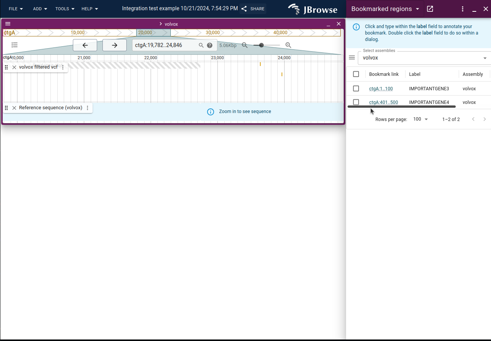

# An example JBrowse 2 plugin

From office hours meeting

This plugin

- adds a custom feature detail panel for a specific track id
- adds some bookmarks by default (hard coded in this case)

## Development environment for this plugin

First clone this repo, and then cd into the folder, and then run:

```
npm install -g yarn # get yarn
yarn  # install dependencies
yarn start # starts a "dev server" for this plugin on port 9000

```

Then I open up a jbrowse instance (I normally am running a dev server on
localhost:3000) and then use
http://localhost:3000/?config=http://localhost:9000/config.json and it will load
the config.json file from this repo, and the config.json refers to the built
plugin in `dist/jbrowse-plugin-extra-panel.development.umd.js`

## Deploying this plugin to production

When you are ready for production, you can use

```
yarn build
```

And then copy the file from the
`dist/jbrowse-plugin-extra-panel.production.umd.js` into the folder where your
production jbrowse is being used, and make a similar update to your production
config.json (I just hand edit the config.json for this, there is no jbrowse CLI
to add a plugin to the config.json)

Hope this helps!

## Screenshots


the extra feature panel in the sidebar after clicking on a VCF feature, uses the
"Core-extraFeaturePanel" extension point (see jb2 docs for more details)



the bookmark panel which loads on page load, by default, see src/index.ts for
this code. it hardcodes the bookmarks that it adds but you could fetch the
bookmarks from a REST API or something else
